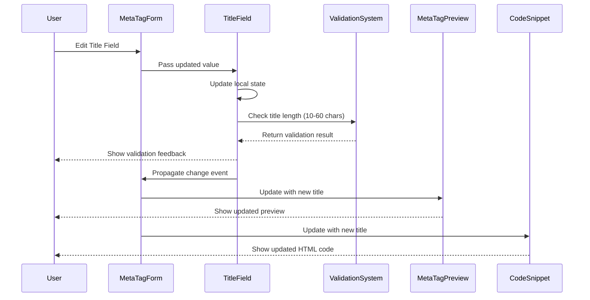

# MVP to Rails Blueprint

A developer-first system to build MVPs using tools like [Lovable.dev](https://lovable.dev) and [V0.dev](https://v0.dev), 
while maintaining a structured Rails blueprint in parallel for clean, scalable migration to Ruby on Rails using Phlex and Hotwire.

---

## 🎯 Purpose

The goal of this repository is to bridge the gap between fast-paced React MVP development and robust Rails applications. 
While developers use tools like Lovable.dev or v0.dev to design React-based MVPs, this blueprint ensures Rails readiness from day one.

---

## 📁 Directory Structure

```bash
mvp-rails-blueprint/
├── src/                         # React MVP code lives here
├── docs/                        # Rails conceptual mapping
│   ├── context.md               # Guidelines and system instructions
│   ├── react_to_rails_template.md # Template: React to Rails mapping
│   ├── rails_directory_mapping_template.md # Template: Rails structure mapping
│   ├── requirements.md          # MVP product ideation and notes
│   ├── schema.json              # Centralized content + structure model
│   └── rails_structure/         # Conceptual Rails equivalents
│       ├── models.md
│       ├── views.md
│       ├── controllers.md
│       ├── stimulus.md
│       ├── api_interactions.md
│       ├── database_schema.md
│       ├── routing.md
│       └── rails_phlex_hotwire_considerations.md
├── .gitignore
├── README.md
├── LICENSE
```

---

## 🛠️ How to Use

1. **Build in Lovable.dev or V0.dev**
   - Start your MVP visually.
   - Use Rails-inspired naming where possible (e.g., `PostCard`, `UserSettingsForm`).

2. **Document the Rails-side mapping**
   - For each new React component, document its Rails/Phlex equivalent under `docs/rails_structure/views.md`.
   - If the component uses data, consider its future `model` and `controller` in Rails, and document that too.

3. **Use schema.json**
   - All structured content (routes, sections, data) must go into `schema.json`.
   - It is the single source of truth until a backend like Supabase is added.

4. **Update Docs Automatically**
   - Every time content or structure changes in your MVP, reflect it in `docs/schema.json` and Rails docs.
   - Keep this repo clean and ready to transition to full Rails implementation.

---

## 🧠 Best Practices

- Favor components and naming that will cleanly map to Rails MVC patterns.
- Think in terms of MVC even during the MVP phase.
- Use Stimulus-style behavior when interactions are needed and document logic for future controllers.
- Focus on **clarity**, **structure**, and **maintainability**—this is your MVP-to-Rails conversion map.

---

## Results from lovable.dev
This is how lovable.dev produced the docs based on input context and templates


### Example of produced sequence diagram:


